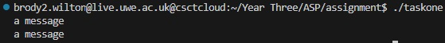
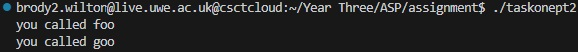
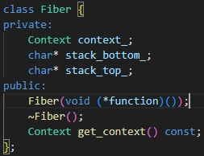
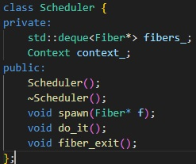
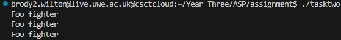

### Advanced Systems Programming - Assignment

## Table of Contents

1. [Introduction](#introduction)
2. [Task 1 - Part One](#task-1---part-one)
3. [Task 1 - Part Two](#task-1---part-two)
4. [Task 2](#task-2)
5. [Task 2 - Tests](#task-2---tests)


## Introduction
This project, written in c++, implements a simple runtime that supports different fibers running within a single thread along with a basic scheduler to manage their execution. 

## Task 1 - Part One
This part explores the basics and implements a program that uses the provided context library to save and restore execution state and allows control flow to transfer between different function calls. It also demonstrates correct memory alignment and layout in accordance with the System V ABI. 

To build, run the following command whilst inside the directory containing the task_one_pt2.cpp file:

```bash
clang++ -std=c++17 -I./context -o taskone context/context.o task_one.cpp
```

and then execute with:

```bash
./taskone
```

Here is the displayed output of the compiled file:



## Task 1 - Part Two
This task further builds upon the first task to include another function and demonstrates the creation of fibers with their own memory stacks and continues to demonstrate the correct memory alignment and layout in accordance with the System V ABI.

To build, run the following command whilst inside the directory containing the task_one_pt2.cpp file:

```bash
clang++ -std=c++17 -I./context -o taskonept2 context/context.o task_one_pt2.cpp
```

and then execute with:

```bash
./taskonept2
```

Here is the displayed output of the compiled file:



## Task 2
This task is primarily focussed around creating distinct classes to handle both the fibers functionality, and an additional class which handles a new implementation: the Scheduler. The scheduler enables fibers to be added to a queue, using spawn, and then those fibers can be executed in a round-robin fashion with the do_it method.

The main features of this task are:




To build, run the following commands whilst inside the directory containing the task_one_pt2.cpp file:

```bash
clang++ fiber.cpp -o fiber.o
clang++ scheduler.cpp -o scheduler.o
clang++ -std=c++17 -I./context task_two.cpp fiber.o scheduler.o context/context.o -o tasktwo
```

and then execute with:

```bash
./tasktwo
```

Here is the displayed output of the compiled file:



## Task 2 - Tests
